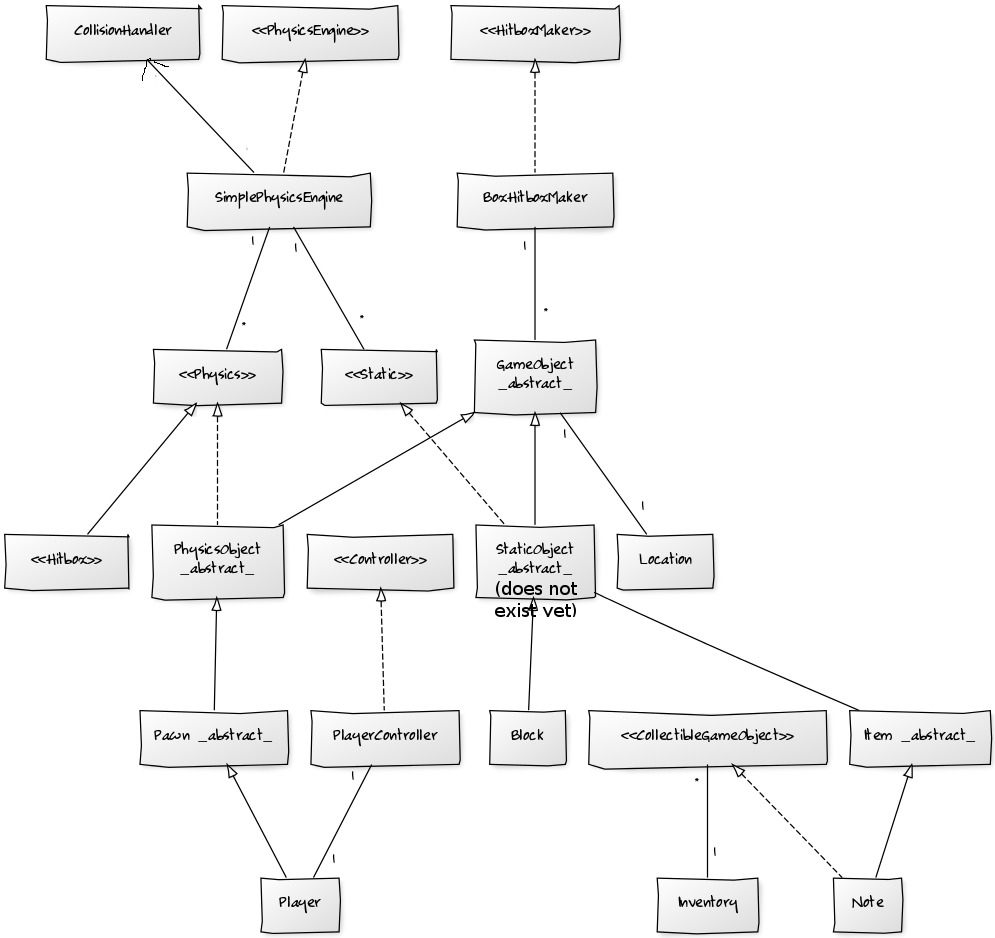
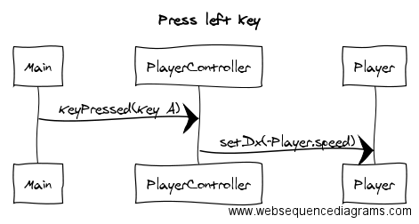
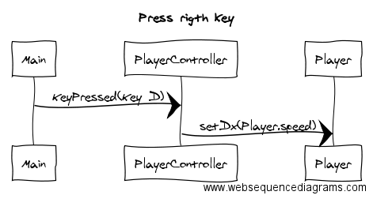
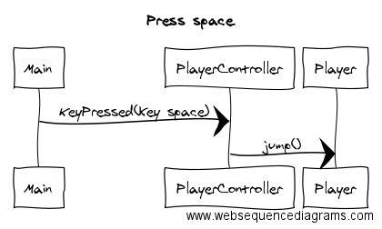
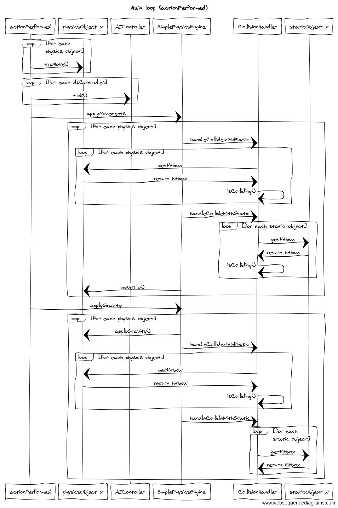

**Aihemäärittely**

**Aihe:**
  Tasohyppelypeli. Pelissä voi liikkua ennalta määritellyssä ympäristössä vasemmalle ja oikealle sekä hypätä. Pelissä tulee kerätä
  esineitä ja varoa vihollisia. Esineet ovat opiskelijan muistiinpanoja, jotka hän on kadottanut lukiessaan ylioppilaskirjoituksiin.
  Pelaajan tulee kerätä kaikki muistiinpanot ja varoa vaarallisia logaritmeja syömästä häntä ikuiseen käänteiseksponenttihelvettiin.
  
  Aiheessa tulee pelilogiikan kannalta ottaa huomioon törmäykset (collisions), painovoima, liikkuminen, kerättävät esineet sekä viholliset.
  
**Kuvaus:**
GameObject on kaikkien palikoiden äiti. Physics- ja Static- rajapinnat tuovat tarvittavia ominaisuuksia omanlaisilleen objekteille. PhysicsEngine käyttää näitä objekteja hallitessaan kartan fysiikkaa. Palikoilla ei ole mitään rippuvuuksia PhysicsEngineen. PhysicsEngine käyttää palikoita Physics- ja Static- rajapintojen kautta. UI hallitsee karttaa ja alustaa PhysicsEngineen kaikki tarvittavat palikat. UI piirtää palikat niiden ilmoittamaan sijaintiin ja PhysicsEngine päivittää niiden sijainteja. Törmäyksiä hallitaan HitBoxeilla, jotka ovat ArrayListeja Location-olioista. Törmäys tapahtuu, jos hitboxeissa on samoja Location olioita.

**Käyttöohje**
Liikkuu A ja D naäppäistä. Hyppää välilyönnillä. Kerää kaikki liilat laatikot ja mene valkoiselle laatikolle. Älä osu oransseihin laatikoihin. Seiniin voi tarttua ja niitä pitkin hypellä.
**Käyttäjät:** Pelaaja

**Pelaajan toiminnot:** 
  * Liiku vasemmalle
  * Liiku oikealle
  * Hyppää

**Luokkakaavio**

**Sekvenssikaavioita**

-

-

-

